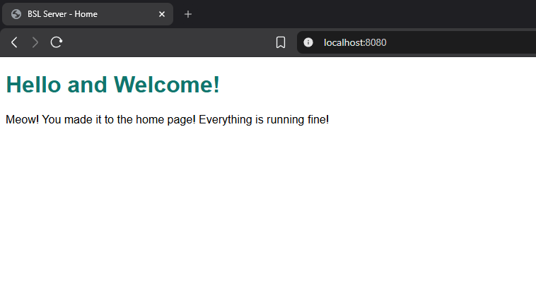
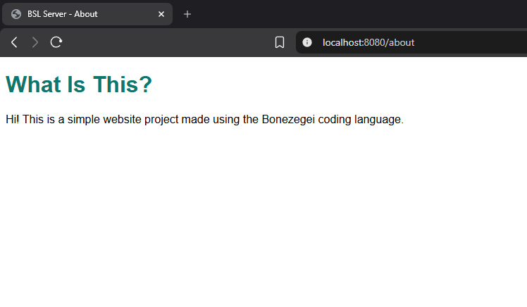
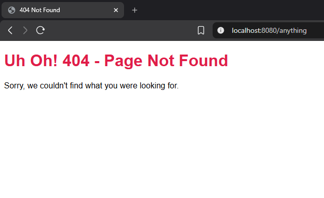
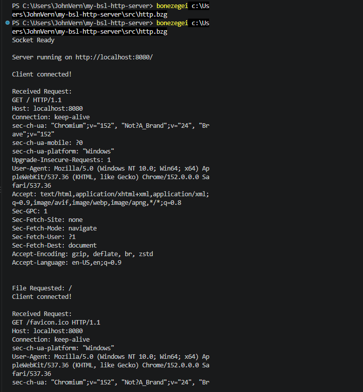

# MY-BSL-HTTP-SERVER

## 1. Project Description

This project was developed as part of **Lab 1: Building an HTTP Server using Socket**. 

This HTTP web server was implemented from scratch using the **Bonezegei Scripting Language (BSL)** and its native socket library. This server handles networking operations manually:
* Opening a raw network socket
* Binding to a local network port (`8080`)
* Listening for incoming TCP client connections
* Parsing raw incoming HTTP request strings
* Formulating and transmitting standard HTTP response headers and payloads back to the client

### Route Architecture
The server listens on `http://localhost:8080` and manages three primary routing behaviors:

You can navigate through different endpoints in the browser by entering these:

Home Page:
http://localhost:8080/

About Page:
http://localhost:8080/about

404 Error Page:
http://localhost:8080/anything
(Or any other non-existent route like /home, /test, /user)
Triggers a 404 Not Found response.

| Route / Endpoint | Description | Status Code |
| :--- | :--- | :--- |
| `/` | Application landing / home page | `200 OK` |
| `/about` | Information page regarding the project and implementation | `200 OK` |
| `/*` *(unmapped)* | Wildcard fallback for undefined paths (e.g., `/anything`, `/home`) | `404 Not Found` |

---

## 2. Installation & Setup Guide

Follow these steps sequentially to set up the BSL environment, fetch dependencies, and launch the server.

### Prerequisites
1. **Bonezegei Scripting Language (BSL) Interpreter**:
   * Open **VS Code**.
   * Navigate to the **Extensions** tab (`Ctrl+Shift+X` or `Cmd+Shift+X`).
   * Search for **Bonezegei** and install the **Bonezegei Scripting Language Formatter** extension.
   * Open the extension details and follow the instructions to install the BSL interpreter for your operating system:
     * **Windows / Linux:** Follow the installer instructions provided in the guide.
     * **macOS / Android:** Launch the project inside **GitHub Codespaces** and follow the Linux setup guide.

### Setup Instructions

1. **Clone the repository and enter the directory:**
   ```bash
   git clone https://github.com/KaDabRa911/MY-BSL-HTTP-SERVER.git
   cd my-bsl-http-server

2. **Install the socket library:**
   ```bash
   bzg install socket
   
3. **Run the HTTP server:**
   ```bash
   bonezegei src/http.bzg
   
4. **Verify startup:**
   ```bash
   Socket Ready
   Server running on http://localhost:8080/

### Screenshots
All screenshot assets are located in the documentation/ folder.

1. Home Route (/)



3. About Page (/about)



4. 404 Error Page (/anything)



5. Terminal Page

